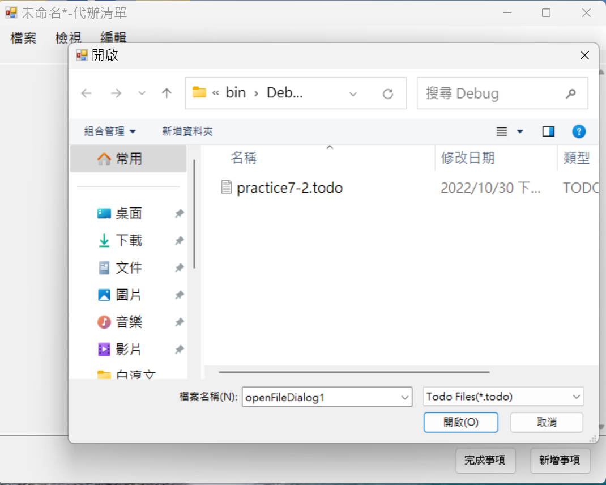
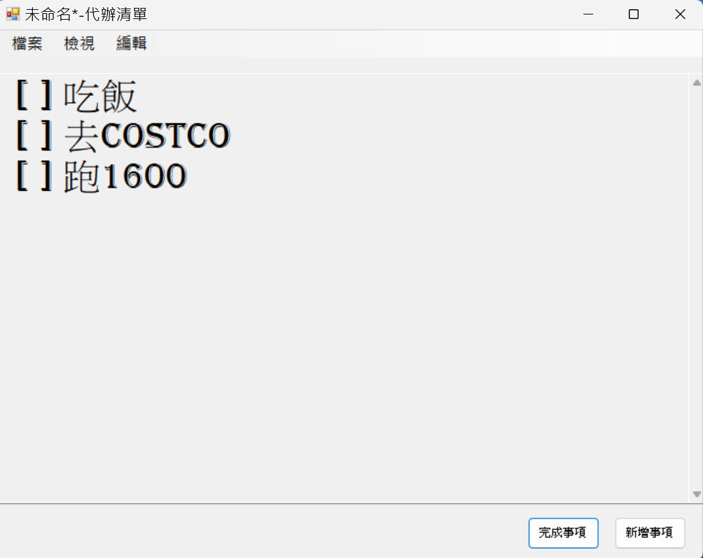
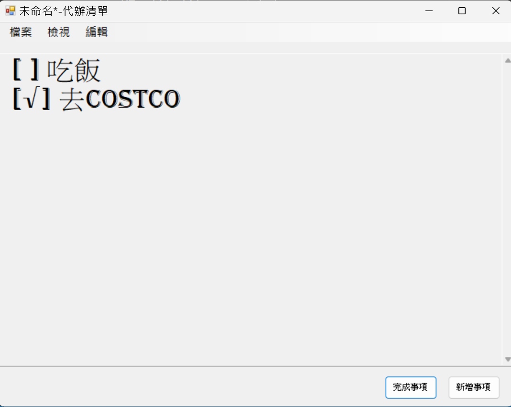

# to_do_list
## About
A C# Windows Programming project.  
This application has the following features:
* complete  items / delete  items / add new items 
* show / hide completed items 

* search specified items
* modified the display font style /size
* read / write the to_do_list to a local text file
## Learning Objective
- Using the C# ***List*** class to accomplish to-do list  basic operations 

- Read / Write components such as ***saveFileDialog、openFileDialog***.
- multi-Form application
- Understanding C# built-in ***StreamReader、StreamWriter、FileInfo*** classes.

## showcase
### Read/write files

### add items

### complete / delete items

